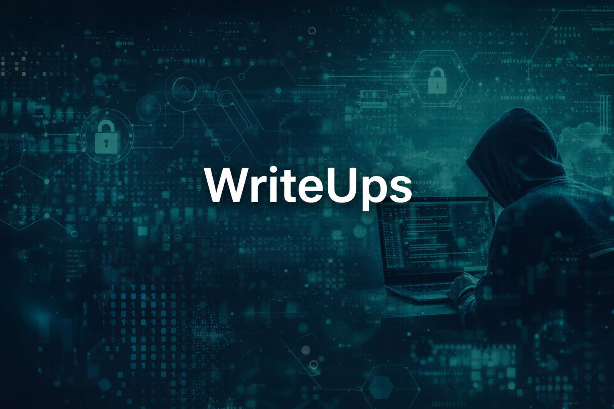

<h1>WriteUps</h1>
  

Repositorio donde documento mis **WriteUps de máquinas vulnerables** resueltas en entornos controlados como **DockerLabs**.

Cada WriteUp incluye:

- 🔍 Reconocimiento
- 🌐 Enumeración
- 💣 Explotación
- 🔓 Escalada de privilegios
- 📸 Evidencias (screenshots)
- 💻 Comandos utilizados

> [!IMPORTANT]
> Este repositorio se encuentra en constante actualización a medida que avanzo en mi aprendizaje en ciberseguridad.

---

## 📊 Máquinas documentadas

**Total:** 1

---

## ❓ ¿Qué es un WriteUp?

Un **WriteUp** es un informe técnico que documenta paso a paso cómo se resolvió una máquina o desafío de ciberseguridad.

Incluye:

- Análisis del sistema objetivo  
- Identificación de vulnerabilidades  
- Técnicas de explotación  
- Obtención de acceso  
- Escalada de privilegios  

📌 Además, funciona como:

- Portafolio profesional  
- Evidencia de habilidades técnicas  
- Base de conocimiento reutilizable  

---

# 🐳 DockerLabs

Máquinas resueltas en entorno Docker orientadas a práctica de **pentesting realista**.

---

## 🟢 Fácil

- [`Trust`](./DockerLabs/trust/README.md)  
  → Enumeración de servicios (SSH y HTTP), análisis web básico, descubrimiento de credenciales y acceso inicial mediante fuerza bruta, seguido de escalada de privilegios en sistema Linux.

---

# 🧰 Herramientas utilizadas

- Nmap  
- Gobuster  
- Hydra  
- Netcat  
- Docker  

---

# 👨‍💻 Autor

**Johann Lizana**  
Estudiante de Ingeniería en Computación e Informática  

---

# 📌 Objetivo del repositorio

Construir un portafolio técnico sólido enfocado en:

- Pentesting  
- Ethical Hacking  
- Análisis de vulnerabilidades  
- Automatización y herramientas  
